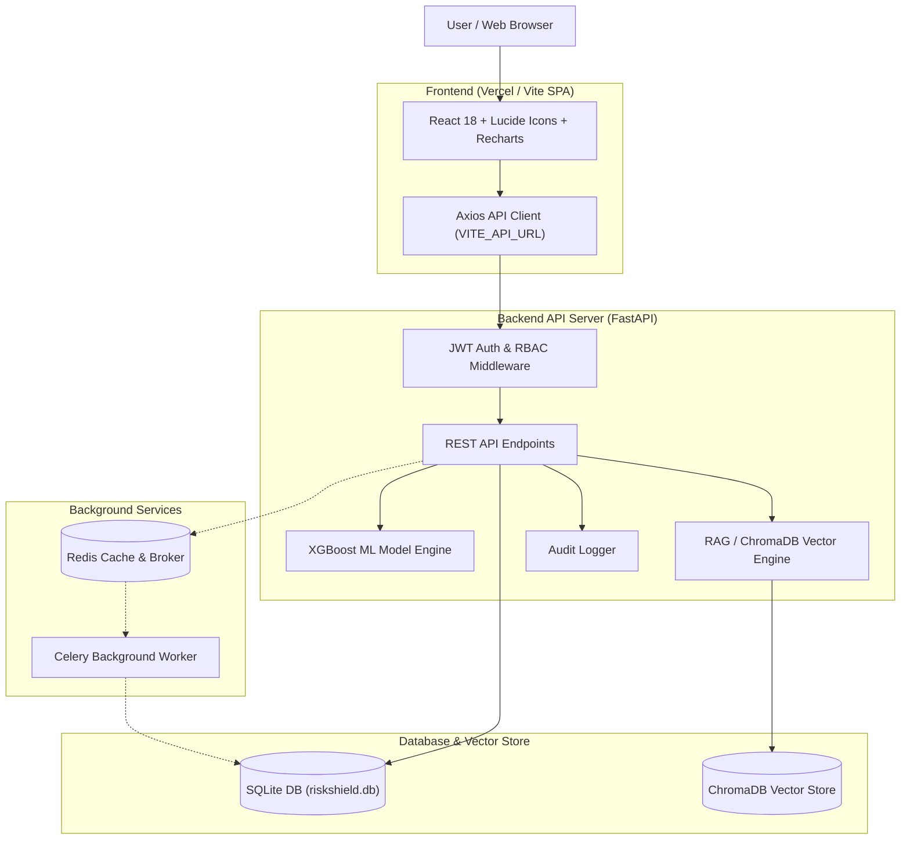

# RiskShield AI

An enterprise financial fraud detection and risk analysis platform combining machine learning risk scoring, automated RAG-based AI investigation, and role-based operational workflows.

---

## Overview

RiskShield AI processes credit card and payment transaction data to identify potential fraud, estimate financial risk impact, and assist risk analysts with automated AI investigation reports. 

The platform supports a multi-role workflow:
- **System Administrators** configure AI providers, tune model risk cutoff thresholds, manage user account approvals, and communicate with risk analysts.
- **Risk Analysts** evaluate high-risk transactions, run AI Copilot policy investigations, override decision statuses, and communicate with admins.
- **Viewers** possess read-only access to transaction tables and metrics.

---

## Features

### Core Risk Assessment & Machine Learning
- **XGBoost Risk Scoring**: Predicts fraud probabilities and classifies transactions into `APPROVE`, `REVIEW`, or `HOLD` status.
- **Dynamic Threshold Tuning**: Adjustable cutoff threshold slider with real-time recalculation of false positive/negative counts, simulated risk costs, and net savings.
- **SHAP Feature Explanations**: Local feature contribution breakdown explaining why specific transactions received high risk scores.

### AI Copilot & Automated Investigation
- **RAG/CRAG/SRAG Investigation Pipeline**: Retrieves policy guidelines and velocity statistics to generate automated risk reports.
- **Bring-Your-Own-Key (BYOK) Multi-LLM Support**: Supports Google Gemini, OpenAI, Groq, and OpenRouter providers with dynamic in-app configuration.
- **AI Key Request Workflow**: Notifies Admins when an API key is missing or unconfigured directly from the Copilot interface.

### Role-Based Operations & Communication
- **Role-Based Access Control (RBAC)**: Strict permission boundaries for `Admin`, `Analyst`, and `Viewer` accounts enforced at both API and UI levels.
- **Admin User Approval Queue**: New user registrations require explicit Administrator approval before granting login access.
- **Private 1-to-1 Admin ↔ Analyst Channels**: Enterprise messaging console supporting direct channels, unread notification indicators, and request resolution tracking.
- **Immutable Audit Logging**: Logs all AI agent investigations, threshold changes, manual decision overrides, and system events.

### Asynchronous Processing & Performance
- **Redis In-Memory Caching**: Caches system status, active dataset metrics, and key-value telemetry for sub-millisecond response times.
- **Celery Task Queue**: Offloads heavy tasks (CSV ingestion, XGBoost retraining, vector database indexing) to background workers with a graceful synchronous fallback when offline.

---

## User Roles & Permissions

| Feature / Navigation | Administrator | Analyst | Viewer |
| :--- | :---: | :---: | :---: |
| **AI Settings (BYOK Keys & Models)** | ✅ | ❌ | ❌ |
| **Model Performance & Threshold Slider** | ✅ | ❌ | ❌ |
| **Audit Logs** | ✅ | ❌ | ❌ |
| **User Registration Approvals** | ✅ | ❌ | ❌ |
| **Admin ↔ Analyst Communication** | ✅ (All channels) | ✅ (Admin channel) | ❌ |
| **Overview & Metrics Dashboard** | ❌ | ✅ | ❌ |
| **Transactions & CSV Upload** | ❌ | ✅ | ✅ (Read-Only) |
| **Transaction Investigation** | ❌ | ✅ | ❌ |
| **AI Copilot** | ❌ | ✅ | ❌ |
| **Dataset & Scenario Switcher** | ❌ | ✅ | ❌ |

---

## System Architecture



---

## Tech Stack

### Frontend
- **Framework**: React 18.3, Vite 5.2
- **Icons & Visualization**: Lucide React, Recharts
- **HTTP Client**: Axios with JWT Interceptors
- **Styling**: Custom Enterprise Vanilla CSS Design System

### Backend
- **Framework**: FastAPI (Python 3.10+)
- **Server**: Uvicorn
- **Authentication**: PyJWT, Passlib (bcrypt)
- **Data Science**: Pandas, NumPy, Scikit-learn, XGBoost, SHAP

### AI & Vector Database
- **Orchestration**: LangChain, LangGraph
- **Vector Database**: ChromaDB
- **LLM Integrations**: Google Gemini, OpenAI, Groq, OpenRouter

### Database & Background Services
- **Database**: SQLite (`riskshield.db`)
- **Cache & Message Broker**: Redis 5+
- **Task Queue**: Celery 5.3+

---

## Project Structure

```text
razorpay/
├── backend/
│   ├── agent.py               # RAG AI investigation agent logic
│   ├── auth.py                # JWT authentication & RBAC dependency guards
│   ├── celery_app.py          # Celery worker application configuration
│   ├── database.py            # SQLite database schema, helpers & queries
│   ├── llm.py                 # Multi-provider LLM integration client
│   ├── ml.py                  # XGBoost model training, evaluation & SHAP
│   ├── rag.py                 # ChromaDB vector store initialization
│   ├── redis_client.py        # Redis cache client with fallback handling
│   ├── seed_users.py          # Demo user seeding utility
│   ├── server.py              # Main FastAPI application routes
│   ├── tasks.py               # Celery async background tasks
│   └── utils.py               # Synthetic dataset generator & schema validators
├── data/
│   ├── knowledge/             # Markdown policies & investigation guides
│   └── synthetic/             # CSV transaction datasets
├── frontend/
│   ├── src/
│   │   ├── api.js             # Centralized API service methods
│   │   ├── App.jsx            # Main React SPA component & views
│   │   ├── LoginModal.jsx     # Auth login/registration modal
│   │   ├── main.jsx           # React DOM entry point
│   │   ├── styles.css         # Enterprise CSS design system & animations
│   │   └── UserApprovalView.jsx # Admin approval table component
│   ├── package.json           # Frontend dependencies & Vite scripts
│   └── vercel.json            # Vercel SPA routing rules
├── models/
│   └── model.pkl              # Trained XGBoost model artifact
├── .env.example               # Environment variables template
├── README.md                  # Project documentation
├── requirements.txt           # Python backend dependencies
└── vercel.json                # Root Vercel deployment configuration
```

---

## Environment Variables

Copy `.env.example` to `.env` in the root directory:

```bash
cp .env.example .env
```

| Variable | Scope | Description | Default / Example |
| :--- | :--- | :--- | :--- |
| `VITE_API_URL` | Frontend | Target API URL for frontend HTTP requests | `http://localhost:8000/api` |
| `PORT` | Backend | FastAPI server port | `8000` |
| `JWT_SECRET` | Backend | Secret key used to sign JWT tokens | `your_secret_key` |
| `CELERY_BROKER_URL` | Backend | Redis URL for Celery task broker | `redis://localhost:6379/0` |
| `CELERY_RESULT_BACKEND` | Backend | Redis URL for Celery task results | `redis://localhost:6379/1` |
| `GOOGLE_API_KEY` | Backend | Optional fallback Google Gemini API key | *(BYOK in App UI)* |
| `OPENAI_API_KEY` | Backend | Optional fallback OpenAI API key | *(BYOK in App UI)* |

---

## Local Development Setup

### Step 1: Environment Setup

Create a Python virtual environment and install dependencies:

```bash
python -m venv venv
# On Windows:
venv\Scripts\activate
# On Linux/macOS:
source venv/bin/activate

pip install -r requirements.txt
```

Install frontend dependencies:

```bash
cd frontend
npm install
cd ..
```

### Step 2: Start Backend Server

From the project root:

```bash
uvicorn backend.server:app --port 8000 --reload
```
- API Endpoint: `http://localhost:8000/api`
- OpenAPI Docs: `http://localhost:8000/docs`

### Step 3: Start Celery Worker (Optional)

If Redis is running locally, launch the Celery background worker:

```bash
celery -A backend.celery_app worker --loglevel=info
```
*Note: If Redis or Celery is offline, RiskShield AI automatically operates in Synchronous Fallback mode.*

### Step 4: Start Frontend Server

In a separate terminal, from the project root:

```bash
cd frontend
npm run dev
```
- Web Application URL: `http://localhost:5173`

---

## Production Deployment

### Frontend (Vercel)

1. Connect your repository to Vercel.
2. Set **Root Directory** to `./` or `./frontend`.
3. Set **Framework Preset** to `Vite`.
4. Configure the environment variable in the Vercel Dashboard:
   - `VITE_API_URL` = `https://your-backend-domain.com/api`
5. Deploy. The included `vercel.json` ensures clean single-page application (SPA) routing without 404s on page refresh.

### Backend Deployment

Because the backend relies on persistent storage (SQLite `riskshield.db`, ChromaDB vector files, and optional Redis/Celery workers), deploy the backend service using a persistent container/VM platform:

- **Deployment Options**: Render, Railway, Fly.io, AWS EC2/App Runner, or DigitalOcean Droplet.
- **Docker / Production Server Command**:
  ```bash
  uvicorn backend.server:app --host 0.0.0.0 --port $PORT --workers 4
  ```

---

## Demo Credentials

Default demo accounts available upon initial database initialization:

| Role | Username | Password |
| :--- | :--- | :--- |
| **System Administrator** | `admin` | `admin123` |
| **Lead Fraud Analyst** | `analyst` | `analyst123` |
| **Transaction Viewer** | `viewer` | `viewer123` |
